# Filament Shot

[](https://packagist.org/packages/chengkangzai/filament-shot)
[](https://github.com/chengkangzai/filament-shot/actions?query=workflow%3Arun-tests+branch%3Amaster)
[](https://packagist.org/packages/chengkangzai/filament-shot)

Render Filament v4/v5 UI components — Forms, Tables, Infolists, and Stats Widgets — as PNG screenshots programmatically. Define your components using familiar Filament classes and get pixel-perfect images without spinning up a browser manually.

## Examples

These screenshots are automatically generated by CI to verify rendering quality.

### Forms

| Light | Dark |
|-------|------|
| 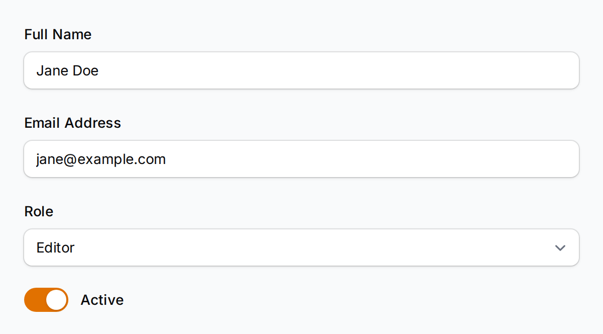 | 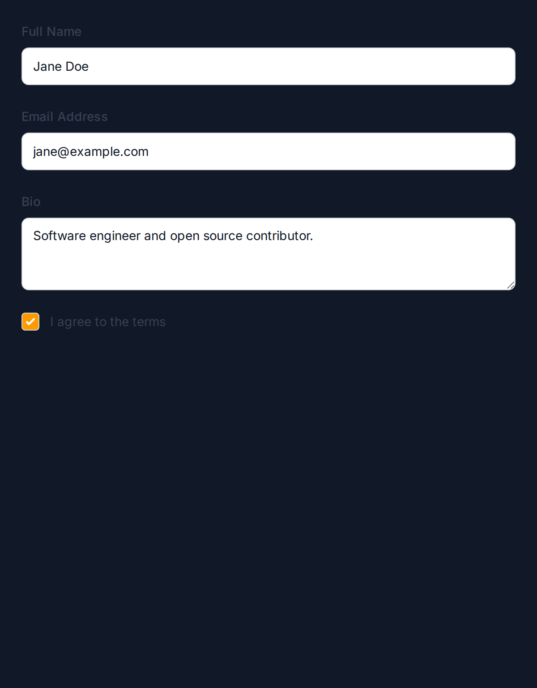 |

| Section Layout | Grid Layout |
|----------------|-------------|
| 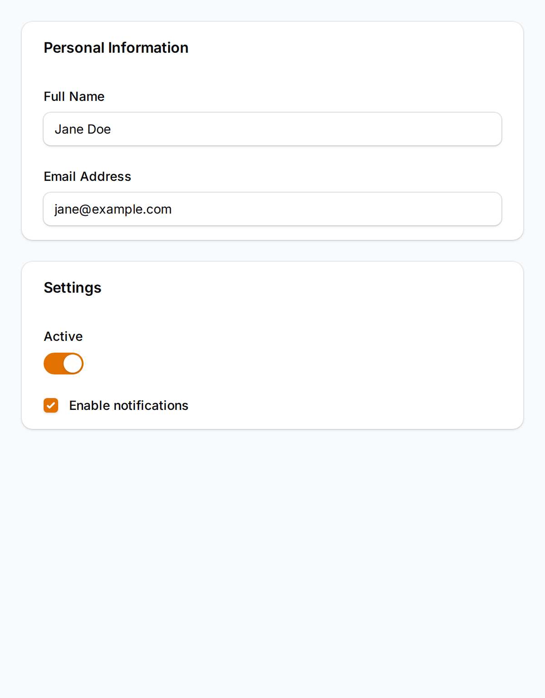 | 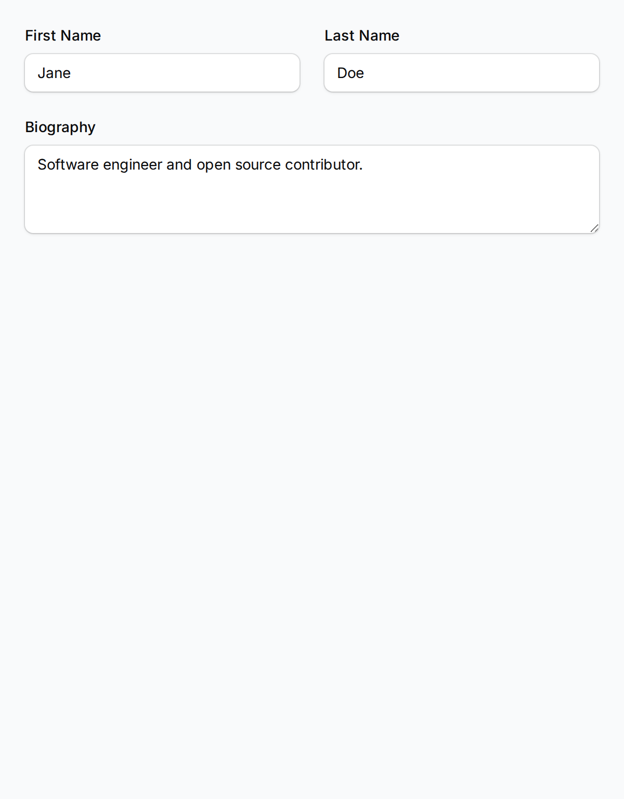 |

| Additional Field Types |
|------------------------|
| 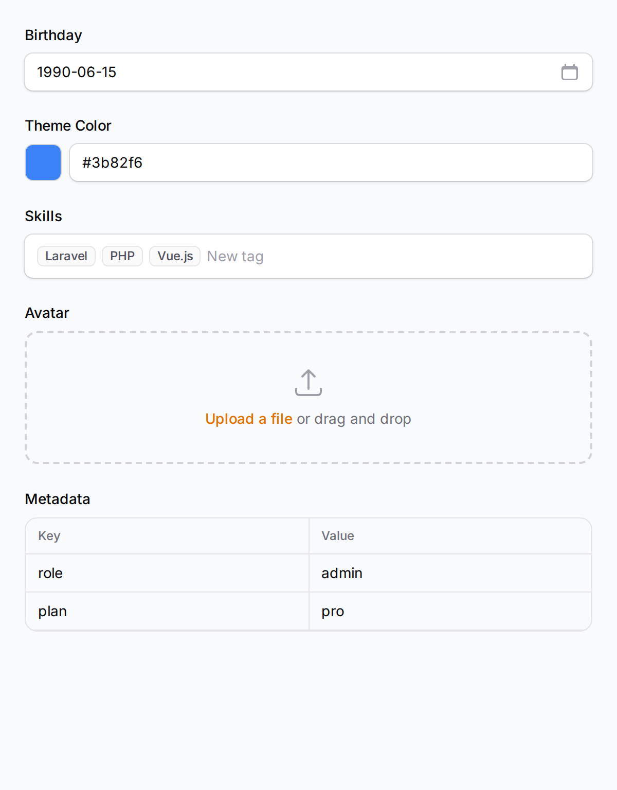 |

### Tables

| Basic | With Badges |
|-------|-------------|
| 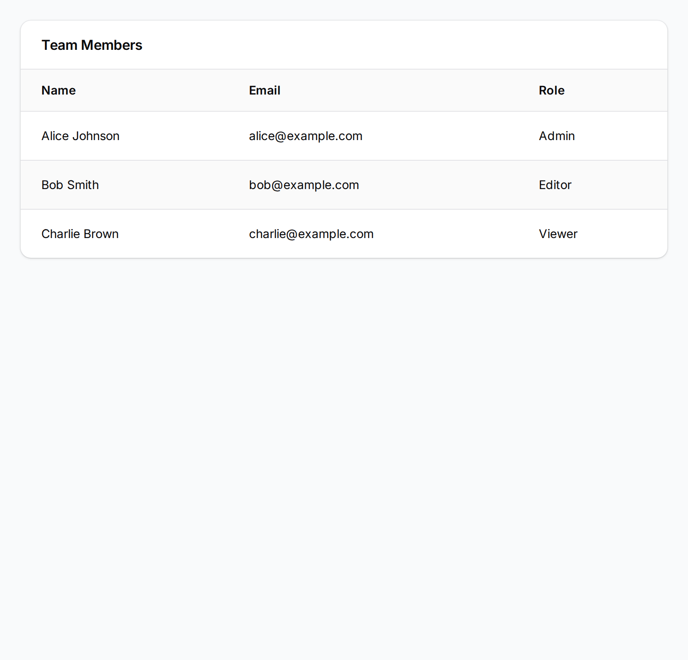 | 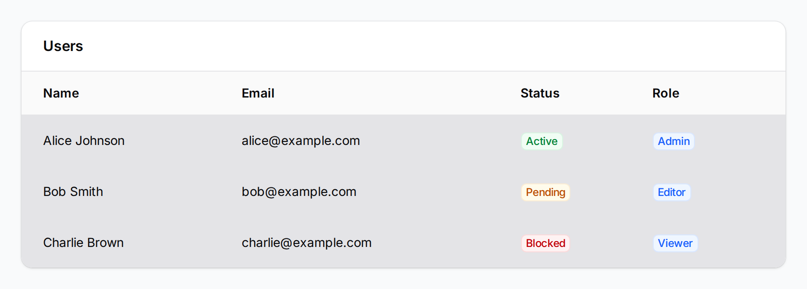 |

| Styled (Weight + Mono Font) | Dark Mode |
|------------------------------|-----------|
| 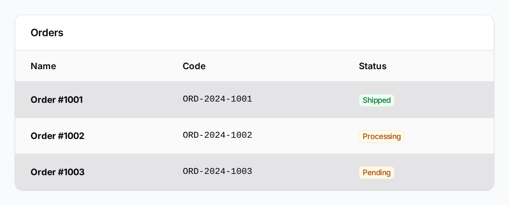 | 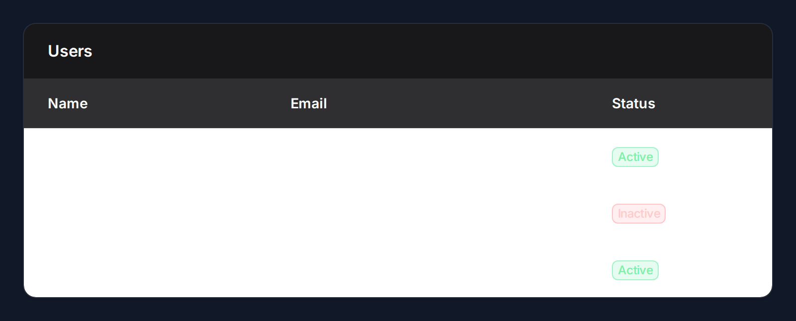 |

| Icon Column (Boolean) |
|-----------------------|
| 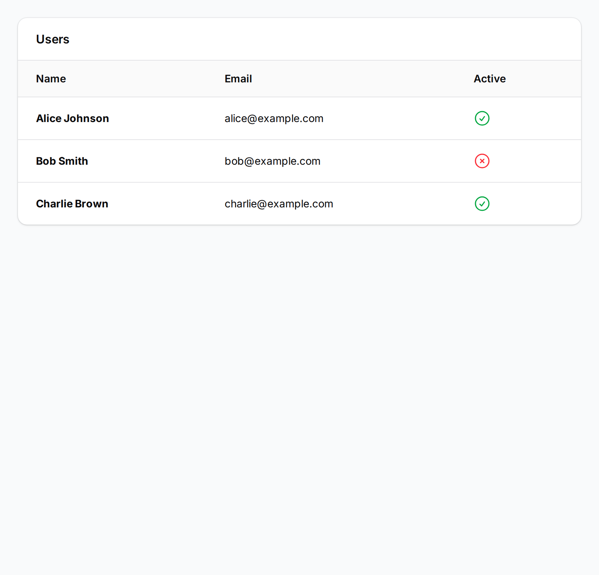 |

### Infolist

| Light | Dark |
|-------|------|
| 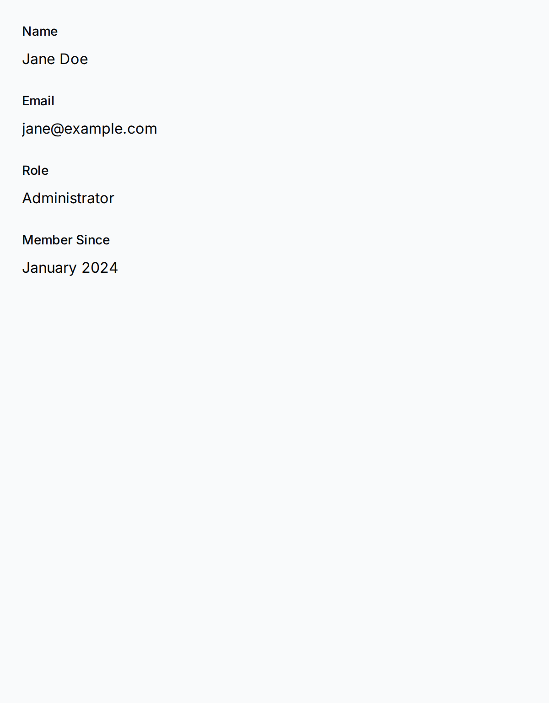 |  |

### Stats Widgets

| Light | Dark |
|-------|------|
| 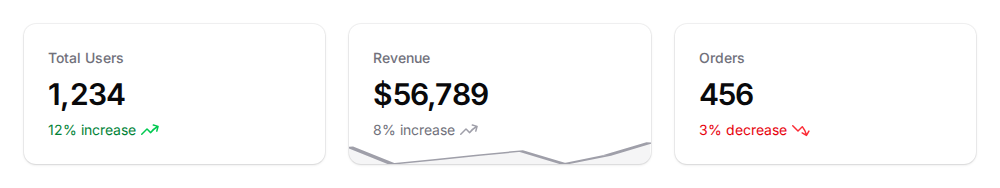 | 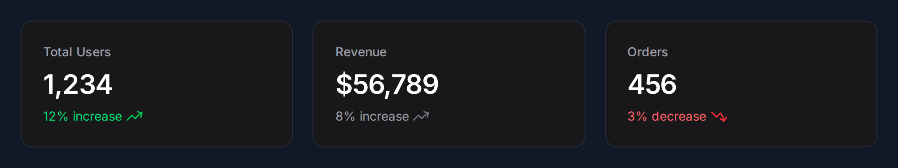 |

## How It Works

Filament Shot generates standalone HTML using its own Blade templates styled with Filament's CSS classes, then captures screenshots via [Browsershot](https://github.com/spatie/browsershot). This avoids Livewire context issues entirely — no running application or panel required.

## Requirements

- PHP 8.2+
- Laravel 11+
- Filament v4 or v5
- Node.js 18+ and [Puppeteer](https://pptr.dev/)
- A Chromium-based browser (Chrome, Chromium, etc.)

## Installation

Install the package via Composer:

```bash
composer require chengkangzai/filament-shot
```

Install Puppeteer (required by Browsershot):

```bash
npm install puppeteer
```

Publish the config file (optional):

```bash
php artisan vendor:publish --tag="filament-shot-config"
```

## Usage

### Forms

Capture Filament form components as an image:

```php
use CCK\FilamentShot\FilamentShot;
use Filament\Forms\Components\TextInput;
use Filament\Forms\Components\Select;
use Filament\Forms\Components\Toggle;

FilamentShot::form([
    TextInput::make('name')
        ->label('Full Name')
        ->placeholder('Enter your name'),
    TextInput::make('email')
        ->label('Email Address')
        ->placeholder('you@example.com'),
    Select::make('role')
        ->label('Role')
        ->options([
            'admin' => 'Administrator',
            'editor' => 'Editor',
            'viewer' => 'Viewer',
        ]),
    Toggle::make('active')
        ->label('Active'),
])
->state(['name' => 'Jane Doe', 'email' => 'jane@example.com'])
->save('form.png');
```

Supported field types: `TextInput`, `Select`, `Textarea`, `Toggle`, `Checkbox`, `Radio`, `Placeholder`, `DatePicker`, `DateTimePicker`, `FileUpload`, `ColorPicker`, `TagsInput`, `KeyValue`, `RichEditor`, `MarkdownEditor`, `Repeater`.

Layout components: `Section`, `Grid`, `Fieldset`.

#### Forms with Layout Components

```php
use CCK\FilamentShot\FilamentShot;
use Filament\Forms\Components\TextInput;
use Filament\Forms\Components\Toggle;
use Filament\Schemas\Components\Section;

FilamentShot::form([
    Section::make('Personal Information')
        ->schema([
            TextInput::make('name')->label('Full Name'),
            TextInput::make('email')->label('Email'),
        ]),
    Section::make('Settings')
        ->schema([
            Toggle::make('active')->label('Active'),
        ]),
])
->state(['name' => 'Jane Doe', 'email' => 'jane@example.com', 'active' => true])
->save('form-with-sections.png');
```

### Tables

```php
use CCK\FilamentShot\FilamentShot;
use Filament\Tables\Columns\TextColumn;

FilamentShot::table()
    ->columns([
        TextColumn::make('name'),
        TextColumn::make('email'),
        TextColumn::make('role'),
    ])
    ->records([
        ['name' => 'Alice', 'email' => 'alice@example.com', 'role' => 'Admin'],
        ['name' => 'Bob', 'email' => 'bob@example.com', 'role' => 'Editor'],
        ['name' => 'Charlie', 'email' => 'charlie@example.com', 'role' => 'Viewer'],
    ])
    ->heading('Team Members')
    ->striped()
    ->save('table.png');
```

### Infolists

```php
use CCK\FilamentShot\FilamentShot;
use Filament\Infolists\Components\TextEntry;

FilamentShot::infolist([
    TextEntry::make('name')->label('Name'),
    TextEntry::make('email')->label('Email'),
    TextEntry::make('joined')->label('Member Since'),
])
->state([
    'name' => 'Jane Doe',
    'email' => 'jane@example.com',
    'joined' => 'January 2024',
])
->save('infolist.png');
```

### Stats Widgets

```php
use CCK\FilamentShot\FilamentShot;
use Filament\Widgets\StatsOverviewWidget\Stat;

FilamentShot::stats([
    Stat::make('Total Users', '1,234')
        ->description('12% increase')
        ->descriptionIcon('heroicon-m-arrow-trending-up')
        ->color('success'),
    Stat::make('Revenue', '$56,789')
        ->description('8% increase')
        ->chart([7, 3, 4, 5, 6, 3, 5, 8]),
    Stat::make('Orders', '456')
        ->description('3% decrease')
        ->descriptionIcon('heroicon-m-arrow-trending-down')
        ->color('danger'),
])
->save('stats.png');
```

## Output Methods

Every renderer supports multiple output methods:

```php
$renderer = FilamentShot::form([...]);

// Save to disk
$renderer->save('/path/to/screenshot.png');

// Get base64-encoded PNG
$base64 = $renderer->toBase64();

// Get rendered HTML (useful for debugging)
$html = $renderer->toHtml();

// Get an HTTP response with the PNG
return $renderer->toResponse();
```

## Customization

### Viewport

Control the screenshot dimensions and resolution:

```php
FilamentShot::form([...])
    ->width(1280)
    ->height(720)
    ->deviceScale(2)  // Retina / HiDPI
    ->save('screenshot.png');
```

### Theme

Switch between light and dark mode, or set a custom primary color:

```php
FilamentShot::form([...])
    ->darkMode()
    ->primaryColor('#3b82f6')
    ->save('dark-form.png');
```

### Artisan Command

Capture screenshots from a config file:

```bash
php artisan filament-shot:capture --config=screenshots.php
```

The config file should return an array of screenshot definitions:

```php
<?php

use Filament\Forms\Components\TextInput;

return [
    [
        'type' => 'form',
        'components' => [
            TextInput::make('name')->label('Name'),
            TextInput::make('email')->label('Email'),
        ],
        'output' => 'storage/screenshots/form.png',
        'width' => 800,
        'dark_mode' => false,
    ],
];
```

Supported types: `form`, `table`, `infolist`, `stats`.

## Configuration

```php
// config/filament-shot.php

return [

    // Default viewport dimensions for screenshots
    'viewport' => [
        'width' => 1024,
        'height' => 768,
        'device_scale_factor' => 2,
    ],

    // Default theme settings
    'theme' => [
        'dark_mode' => false,
        'primary_color' => '#6366f1',
    ],

    // Browsershot / Puppeteer configuration
    'browsershot' => [
        'node_binary' => null,       // Path to Node.js binary
        'npm_binary' => null,        // Path to npm binary
        'chrome_path' => null,       // Path to Chrome/Chromium binary
        'no_sandbox' => false,       // Set true for Docker/CI environments
        'timeout' => 60,             // Timeout in seconds
        'additional_options' => [],   // Extra Puppeteer launch options
    ],

    // CSS customization
    'css' => [
        'theme_path' => null,  // Override path to Filament theme CSS
        'extra' => '',         // Additional CSS to inject
    ],

];
```

### Docker / CI Environments

If running in a Docker container or CI pipeline, you'll likely need to enable `no_sandbox`:

```php
// config/filament-shot.php
'browsershot' => [
    'no_sandbox' => true,
],
```

## Testing

```bash
composer test
```

Run only unit tests (no Chrome required):

```bash
vendor/bin/pest --exclude-group=integration
```

Run integration tests (requires Chrome + Puppeteer):

```bash
vendor/bin/pest --group=integration
```

## Changelog

Please see [CHANGELOG](CHANGELOG.md) for more information on what has changed recently.

## Contributing

Please see [CONTRIBUTING](.github/CONTRIBUTING.md) for details.

## Security Vulnerabilities

Please review [our security policy](.github/SECURITY.md) on how to report security vulnerabilities.

## Credits

- [CCK](https://github.com/chengkangzai)
- [All Contributors](../../contributors)

## License

The MIT License (MIT). Please see [License File](LICENSE.md) for more information.
